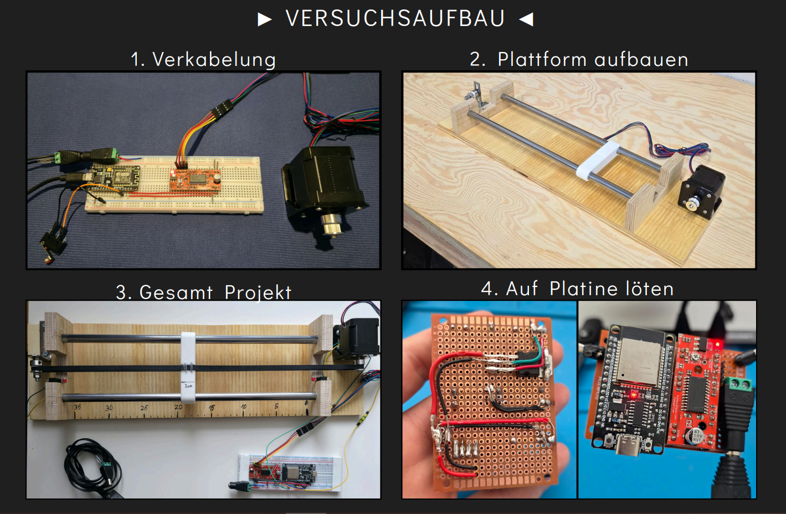
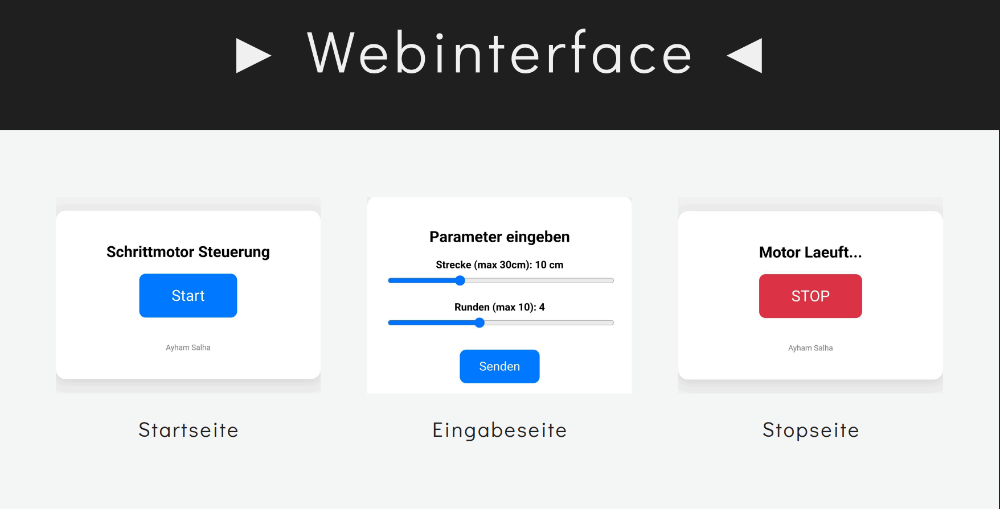

# Stepper Motor Web Control (ESP32)

A web-based learning platform for controlling a stepper motor via an ESP32 microcontroller.  
The project combines embedded systems, mechatronics, and web technologies, enabling users to control motion parameters such as distance, number of cycles, and speed through a browser-based interface.

---

## 📚 Project Purpose

This project was developed as part of **Mechatronics 3** and later reused for **Embedded Systems** coursework.  
Its goal is to demonstrate:

- Web-based control of electromechanical systems
- Safe stepper motor operation with homing and emergency stop
- Integration of software, hardware, and mechanical components

---

## ✨ Features

- **Web Interface** (ESP32 Access Point)
- **Bidirectional Motion Control** (one cycle = forward + backward)
- **Automatic Homing** using limit switch
- **Emergency Stop**
  - Web-based STOP button
  - Hardware safety endstop (interrupt-based)
- **Speed Control** via slider (1 = slow, 10 = fast)
- Stable external power supply (12V → 5V regulator)
- 3D-printed mechanical components

---

## 🔄 System Overview

```
User → Web Interface → ESP32 → Stepper Driver → Stepper Motor
```

- The ESP32 runs as a **WiFi access point**
- Parameters are sent via **HTTP requests**
- Motion is executed step-by-step with real-time stop monitoring
- Safety interrupts immediately stop the motor if triggered

---

## 🛠 Hardware Components

- ESP32 Dev Module
- Stepper Motor + Driver (STEP / DIR)
- Limit switch (homing)
- Safety endstop (emergency stop)
- External power supply (12V, regulated to 5V)
- 3D-printed carriage / mounting parts

---

## 💻 Software & Technologies

- **C++** (Embedded, bare-metal style)
- **ESP32 SDK / PlatformIO**
- **HTML & CSS** (embedded web interface)
- **HTTP Web Server**
- Interrupt-based safety handling
- **Fritzing** (schematics)
- **3D Printing** (STL)

---

## 🚀 How to Run

1. Flash the firmware to the ESP32
2. Power the system (USB or external regulated supply)
3. Connect to the ESP32 WiFi access point
4. Open the web interface in a browser
5. Set:
   - Distance
   - Number of cycles
   - Speed
6. Start the motion
7. Use **STOP** (web or hardware) at any time for safety

---

## � Project Gallery

### Experimental Setup (Versuchsaufbau)


*Complete system setup with ESP32, stepper motor, and mechanical components*


*Browser-based control interface*

---

## 📁 Repository Structure

```
stepper-motor-web-control/
├── firmware/      # ESP32 firmware (PlatformIO)
├── hardware/      # Schematics, wiring, mechanical parts
├── web/           # Web interface (HTML, CSS, JS)
├── images/        # Project photos and setup images
├── docs/          # Documentation and usage
├── README.md
└── .gitignore
```

---

## 👨‍💻 Author

**Ayham Salha**  
*Computational Engineering Student*

💼 [LinkedIn](https://www.linkedin.com/in/ayham-salha)

This project demonstrates practical skills in:

- Embedded software development
- Mechatronic system integration
- Web-based machine control
- Safety-critical system design

---

## 📄 License

MIT License